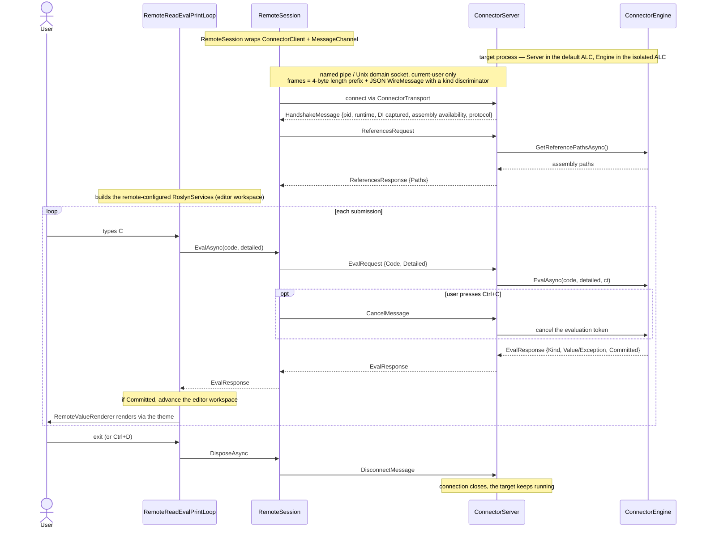
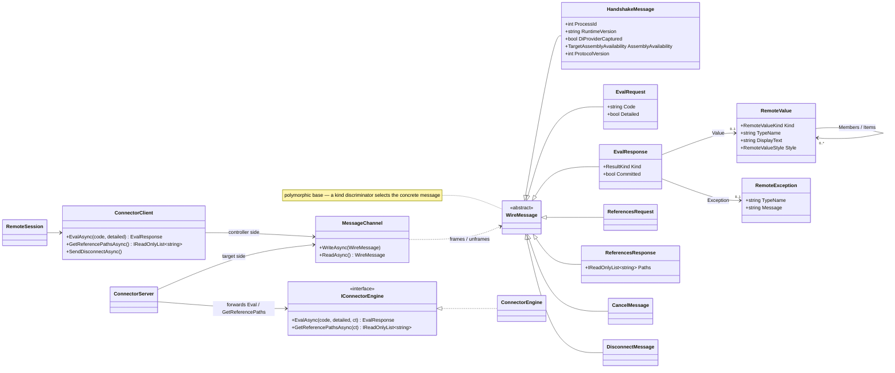

# Architecture

This document describes the design of csharprepl at a high level. It's useful if you want to contribute to csharprepl and are trying to understand how the code is organized and what the various responsibilities are.

Broadly, there are three main components to csharprepl's architecture:

1. [Roslyn libraries](https://github.com/dotnet/roslyn) - Written by Microsoft, these provide both high-level and low-level APIs for building, running, and analyzing C# code.
1. [PrettyPrompt library](https://github.com/waf/PrettyPrompt) - the PrettyPrompt library was written alongside csharprepl, and is packaged as a separate nuget package and repository. It's a Console.ReadLine replacement, and handles terminal features like accepting input, drawing autocompletion menus, syntax highlighting, keybindings, etc, and generally handles the "user experience" of the prompt. It's a general library, and does not know anything about C#; it instead provides callbacks that csharprepl implements to add C#-specific behavior.
1. csharprepl (this repository) - This application uses PrettyPrompt to collect input from the user, invokes the Roslyn APIs on that input, and then prints the result.

Each of the above parts is described in more detail below.

## Roslyn libraries

csharprepl uses two main areas of the Roslyn libraries:

- C# Scripting API ([docs](https://github.com/dotnet/roslyn/blob/b796152aff3a7f872bd70db26cc9f568bbdb14cc/docs/wiki/Scripting-API-Samples.md))
- C# Workspaces API ([docs](https://docs.microsoft.com/en-us/dotnet/csharp/roslyn-sdk/work-with-workspace))

The C# Scripting API allows for evaluating strings containing C# and returns the result. This is the core of the REPL experience; this core is quite simple, and a basic REPL could be implemented in a couple of lines of C# using this API. In csharprepl, this is in `ScriptRunner.cs`.

The C# Workspaces API provides all the ancillary editor features in csharprepl, like syntax highlighting, autocompletion, documentation tooltip information, etc. A workspace is conceptually similar to a Visual Studio solution, and it has multiple projects all contained in memory. Each line of a REPL is implemented as a single project with a single document, and each project has a reference to the previously submitted project. In other words, the workspace is a linked-list of projects, where each project is a line of the REPL. Submitting a new line in csharprepl will create a new project and document. Features like syntax highlighting and autocompletion read this document as their input.

These two APIs are quite separate; one of the main tasks of csharprepl is to ensure that when code is evaluated in the REPL, both of these APIs receive consistent information (see `RoslynServices.cs`).

## PrettyPrompt library

This prompt library is initialized/called in the main `Program.cs`, in the "Read" part of the "Read-Eval-Print-Loop." It's instantiated with callback functions to handle syntax highlighting, autocompletion, and more; these callbacks invoke the above `RoslynServices.cs` class to fulfill the callbacks. The `PromptAdapter` class maps between Roslyn concepts (e.g. a span of text with the syntax classification) and the PrettyPrompt concepts (e.g. a span of text with a syntax highlight color).

## csharprepl

As previously described, csharprepl serves as an intermediary between the above two libraries. There are four main tasks that csharprepl performs:

- `Program.cs` handles basic features like command line arguments, help documentation, and the core read-eval-print-loop.
- Initialization logic is managed in `RoslynServices.cs`. The Roslyn libraries do a lot of heavy lifting and are relatively slow to initialize; RoslynServices serves as an entry point to all Roslyn services, and it manages this initialization in the background to keep csharprepl snappy. It ensures that when the Roslyn services are called, they either don't block, or they wait for initialization to complete if required.
    - You can see this in action by starting csharprepl and typing some C# code really quickly before initialization can fully complete. You'll be able to type without delay as it won't block, but you might see syntax highlighting kick in a few seconds later, after initialization is complete; this is what RoslynServices is managing.
- Synchronization between the C# Scripting API and C# Workspaces API, as described in *Roslyn libraries* above, is also managed by `RoslynServices.cs`. Upon successful evaluation of a script, it updates the workspaces API with a new project and updates the active document to use for syntax highlighting, autocompletion, and more.
- Assembly reference management - Management of [Shared Frameworks](https://natemcmaster.com/blog/2017/12/21/netcore-primitives/), [implementation vs reference assemblies](https://docs.microsoft.com/en-us/dotnet/standard/assembly/reference-assemblies), and adding references dynamically are handled in the `AssemblyReferenceService.cs`. This class is called by our MetadataReferenceResolver implementation, which is an extension point provided by Roslyn.
    - This MetadataReferenceResolver is responsible for evaluating `#r` statements, and delegates for assembly references, nuget package installation, csproj/sln references, and shared framework loading. The implementation is in `CompositeMetadataReferenceResolver.cs`

## Process connector (attaching to a running app)

In addition to the normal REPL — which evaluates code in csharprepl's *own* process — csharprepl can attach to a *separate*, already-running .NET application to evaluate expressions inside it and read/write its live state (statics, DI singletons). The design goal is full local-REPL parity against the other process: declare a `var` or a helper method on one line and reuse it on the next, with the values being the target's real, live objects.

This is a *cooperative in-process* approach rather than a debugger. A debugger evaluates expressions by stopping the target and asking the runtime to do a constrained func-eval; instead, we inject a real Roslyn scripting engine *into* the target and let it run unconstrained C# right where the objects live. The trade-off is that the target must opt in (debugger features like breakpoints, stepping, and non-cooperative attach are out of scope).

### Cooperative Model via Startup Hooks

The target's source is never modified. Attachment is opt-in via a runtime **startup hook** set through an environment variable when the app is launched: the hook runs before the app's entry point and brings up the connector. No startup hook means there is nothing to connect to. Because connecting to the connector is equivalent to running arbitrary code in the target with its privileges, the transport is a per-process, OS-access-controlled channel (a named pipe on Windows, a Unix domain socket elsewhere) scoped to the current user — the same security model as the .NET diagnostic port. A connector-enabled process must never run in production.

csharprepl drives this whole flow itself: one subcommand prints the exact environment variables to launch the app with (so the user doesn't hand-assemble them), and another attaches to a chosen process by its id. To make that work wherever csharprepl is installed, the connector's pieces — the bootstrap, the engine, and the engine's private Roslyn closure — are packaged *alongside* the csharprepl tool in an isolated subdirectory, kept separate from the tool's own assemblies so neither set shadows the other. The printed startup-hook variable simply points at the bootstrap in that subdirectory.

### Assembly load context isolation

The hard problem is that the target may already use Roslyn itself (many apps do, transitively), at a different version. Loading the connector's Roslyn naively would risk colliding with the target's. The design solves this with three projects mapped deliberately onto **assembly load contexts (ALCs)**:

- **`CSharpRepl.InjectedHook`** (the bootstrap) is injected into the target's **default ALC**. It deliberately references *no* Roslyn, so nothing heavy leaks into the target's main context. Its job is plumbing: create an isolated context for the engine, run the transport server, and forward requests.
- **`CSharpRepl.InjectedHook.ScriptEngine`** is loaded into a dedicated **isolated ALC** along with its own Roslyn closure. Because that Roslyn lives in its own context, it coexists with whatever Roslyn the target already loaded — neither disturbs the other.
- **`CSharpRepl.InjectedHook.Contracts`** is the shared boundary. It is loaded **once** in the default ALC and resolved back to that same instance from the isolated context, so the engine interface, the captured-roots/globals types, the projected-result type, and the wire messages are *type-identical* on both sides of the ALC boundary. It, too, references no Roslyn.

The engine builds its compilation references from the **target's own loaded assemblies**, so submissions compile against the target's types and, at runtime, bind to the already-loaded live instances. The upshot: code typed in the REPL sees the target's real objects, and writes are observed by the target's own code.

### Controller and connector: two halves of one REPL

When attached, the csharprepl process becomes a thin **controller**. It compiles nothing for evaluation; it sends code strings over the transport and renders the projected results that come back. Crucially, the engine ships only theme-agnostic data — the engine in the target does the work of turning a live object into a depth-limited, serializable projection, and the controller renders that projection through the *same* theme and value-formatting pipeline the local REPL uses, so remote output is styled identically to local output. The engine inside the target is the source of truth for the submission chain — it holds the persisted script state that gives the line-to-line parity described above, and reports back on each result whether the submission committed to that chain.

This mirrors the local REPL's "two Roslyn worlds kept in sync" idea (see *Roslyn libraries* above), but split across two processes:

- The **scripting world** (executing code, holding script state) lives in the **target**, inside the engine. This is what evaluation and result-rendering already use.
- The **workspace world** (syntax highlighting, autocompletion, symbol lookup) stays in the **controller**, because those are metadata operations that need the target's *types* and prior submission text, not its live object values — so they run locally without a per-keystroke round-trip over the transport. On connect the controller asks the connector for the target's loaded-assembly paths and constructs a second, remote-configured `RoslynServices` seeded with them plus the connector globals (so `services`/`Get<T>()` resolve); the ordinary prompt callbacks then drive that target-aware workspace. It advances only when the engine reports a submission committed — the cross-process analogue of how the local REPL keeps its scripting and workspace APIs consistent.

**Non-interactive connect.** The interactive prompt above (`RemoteReadEvalPrintLoop`) needs a TTY, so for agents and scripts connect mode also has a headless path that parallels the local REPL's `PipedInputEvaluator`. `connect <pid> --eval`/`--eval-file` or piped stdin route to `RemotePipedInputEvaluator`, which drives the same `RemoteSession`, auto-prints the final value as plain/uncolored/unwrapped text on stdout (errors to stderr, nonzero exit), and honors the same `#replace`/`#wrap`/`#patches`/`#revert` commands (wording shared with the interactive loop via `ConnectorCommandResultPrinter`). It skips the editor-workspace seeding above — completion/highlighting are interactive-only, so the reference round-trip would be wasted — and emits no connection chatter. Since the persisted script state lives in the target, separate one-shot `--eval` invocations accumulate state across reconnects.

### Wire protocol and message flow

Controller and connector talk over a single duplex connection — a named pipe on Windows, a Unix domain socket elsewhere, scoped to the current user. Every message is a `WireMessage` framed by `MessageChannel` as a **4-byte little-endian length prefix followed by a UTF-8 JSON body**; the JSON is a `System.Text.Json` polymorphic hierarchy keyed on a `$kind` discriminator, so a single read returns the right concrete message. Frame lengths are bounded and malformed frames surface as a catchable exception rather than crashing either process. All of these types live in the shared `CSharpRepl.InjectedHook.Contracts` assembly, so they're type-identical on both sides.

The exchange over a session's lifetime — connect, capture references for the editor workspace, then a request/response pair per submission (with optional cooperative cancellation), and finally a detach that leaves the target running:

The messages themselves and the classes that produce and consume them:

### Reaching the target's state

Statics and any singletons stored in statics are reachable for free — a submission just names them like ordinary code. For dependency-injected services, the bootstrap cooperatively captures the application's root service provider and exposes it to submissions (as `services` and `Get<T>()`), so a script can resolve the app's real services.

The capture mechanism: before the target's `Main` runs, the bootstrap subscribes to the `"Microsoft.Extensions.Hosting"` `DiagnosticListener` — the same effectively-public contract `HostFactoryResolver` and the EF Core design-time tools rely on. Both `HostBuilder.Build()` and `HostApplicationBuilder.Build()` write a `HostBuilt` event whose payload is the `IHost`; the bootstrap reflects the host's `Services` property off the payload (reflection rather than a typed reference, so the bootstrap carries no hosting dependency and no version coupling) and stores it in the shared `ConnectorRoots`. This covers the non-web Generic Host and modern ASP.NET Core (`WebApplication.CreateBuilder` builds through `HostApplicationBuilder`); the first host built wins, and apps that don't use the hosting abstractions simply report "no provider captured" — statics remain reachable.

### Live method replacement

When attached, the controller can detour a live method in the target to a method the user defines in the REPL, so the running application's behavior changes immediately.

- The user defines a delegate, then runs `#replace` (supplant the original) or `#wrap` (call the original via a leading `orig` delegate). `#patches` lists active patches; `#revert` undoes them.
- The engine's `ConnectorPatcher` detours the method via MonoMod.RuntimeDetour: it resolves the target, matches the overload from the delegate's signature, applies a reversible `Hook`, and tracks it by id.
- The detour repoints native code, so it works across the engine-ALC/target-ALC split: the replacement compiles in the engine ALC and patches a method in the target's default ALC.
- Patches persist until reverted or the process exits, so they outlive a controller detach. `ref`/`out`/`in` parameters work in Replace mode (the patcher emits a delegate type carrying the modifiers, since `Func` can't). Generic methods, pointer parameters, `#wrap` with by-ref, and already-inlined call sites are out of scope.
